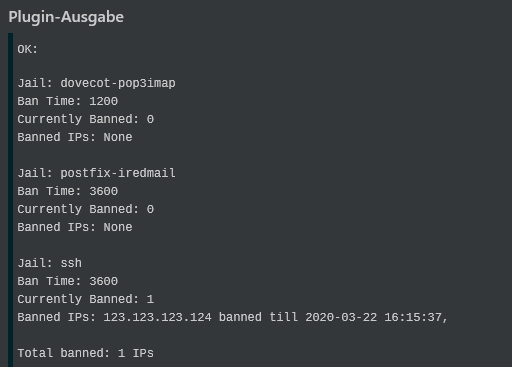

</img>
<h1 align="center">Icinga2 Scripts</h1>
<h3 align="center">check_fail2ban</h3>

  

 
<h3 align="center">
    <a href="https://github.com/n1tr0-5urf3r/icinga2-scripts/releases/">Download Latest
    </a>・
    <a href="https://exchange.icinga.com/n1tr0-5urf3r">Other Projects</a>・<a href="https://www.paypal.com/donate/?hosted_button_id=KXMYX49C6MLLN">Donate</a></h3>

---

## check_fail2ban
### Installation
This plugin requires `fail2ban` and `sudo` installed. Also several commands must be runnable by nagios user with sudo, so add the following to visudo:

        # Needed for check_fail2ban
        nagios  ALL=NOPASSWD: /usr/bin/fail2ban-client status
        nagios  ALL=NOPASSWD: /usr/bin/fail2ban-client status *
        nagios  ALL=NOPASSWD: /usr/bin/fail2ban-client get * bantime
### Usage    
            ./check_fail2ban -h Display this message
                             -w <warning level> defaults to 10
                             -c <crit level> defaults to 20
                             -t Time: Display until when IPs will be banned
                             -j <jaillist> i.e. comma separated string of jails, i.e. ssh,postfix
                                Only check those jails
### Examples
            ./check_fail2ban -t -w 5 -c 10 -j ssh,postfix
            ./check_fail2ban -t

### Example Output

---

## Donation
If you like my work a donation is very welcome :) 

